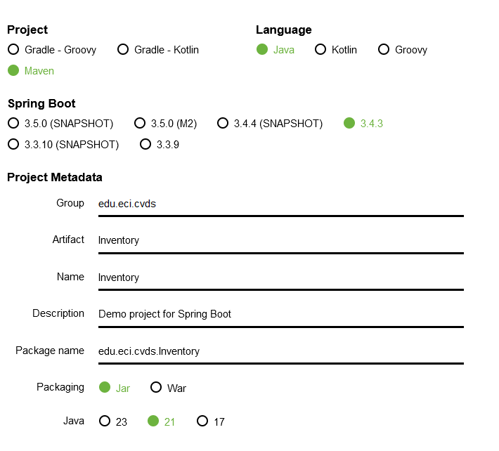
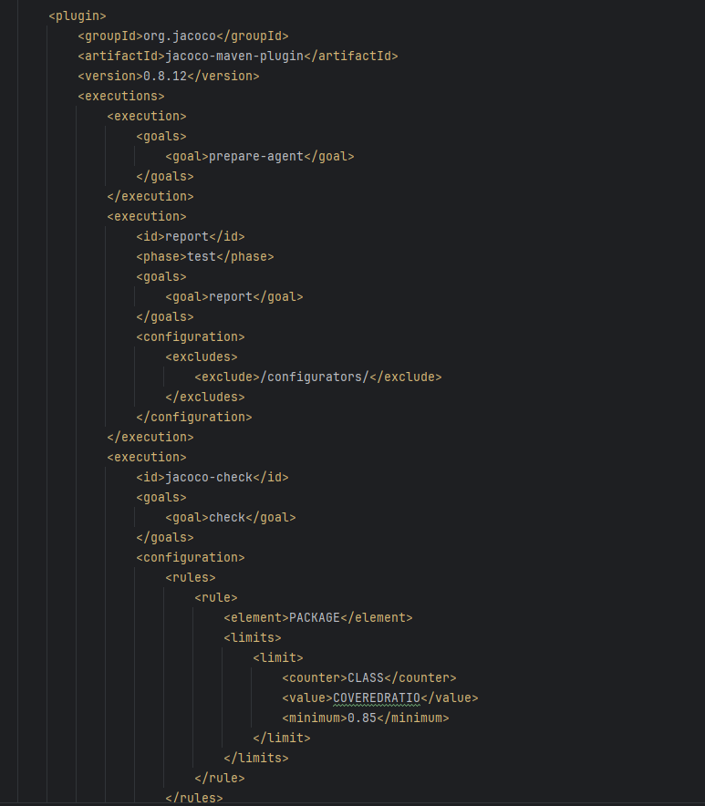
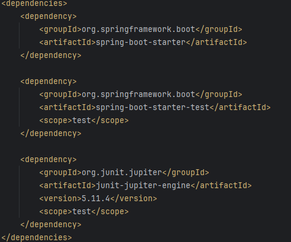
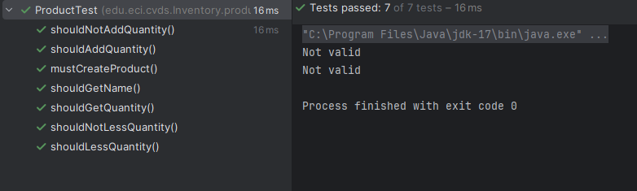
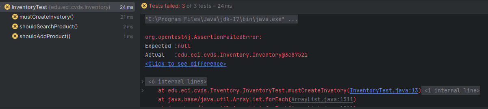
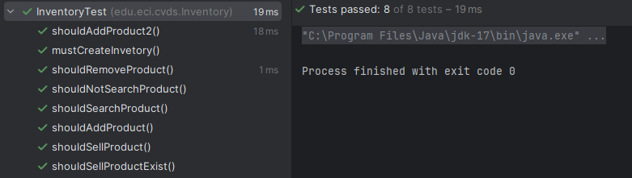
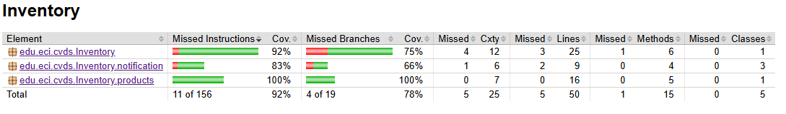

<h1 align="center">CVDS - Parcial 1</h1>
  

    Utilizacion de Maven, jacoco, patrones de diseño y principios SOLID
     
  

 
 

## Preparando el ambiente

Inicialmente creamos el proyecto con ayuda de *Spirng Initializr* y con los parametros que solemos usar como estandar.

Una vez tenemos el proyecto listo, podemos configurar el POM para añadir los plugins de Jacoco para covertura de pruebas y la dependencia de Junit para realizar los test unitarios.

Finalmete tenemos el proyecto listo para comenzar a trabajar en el. Y para comenzar vamos a declarar los test unitarios de inventarios que nos permitira despues desarrollar dicho apartado de la aplicaion mediante DDT.

## Pruebas unitarias y desarrollo dirijido en ellas
Lo primero que se hizo en el parcial, fue definir que clase necesitamos y como se distribuyen para lograr el objetivo. En este caso, una clase de productos, una de inventario y las clases de notificaciones.

### products
En primer lugar, desarrollamos el producto. Inicialmente fallan las ruebas (se me olvido la imagen de fallo de estas pruebas), pero tras la implementacion de la clase, todas pasar correctamente.

### inventario
En segundo lugar, creamos el inventario para poder administrar los productos creados. Nuevamente, desarrollamos las pruebas antes de cualquier implementacion en la clase normal. Y otra vez, fallan en un principio hasta que se implemente el codigo y las pruebas pasen todas.

### notificaciones
En este punto, use una patron de diseño de fabrica simple para poder controlar mejor que tipo de notificacion se usa en cada caso. Para ello se implemento el siguiente diagrama, donde una clase es la encargada de seleccionar el tipo de notificacion.
Imagen de ejemplo por falta de tiempo, basicamente hay que crear una interfaz para que todas las noificaciones puedan ser escojidas por el factory. Asi es mas sencillo saber que tipo de notificaciones tenemos y podemos implementa.

Despues volvemos a realizar las pruebas antes que el desarrollo para luego volver a realizarlas tras la implementacion de codigo.

## Resultados
Como podemos observar, el sistema funciona perfectamente y ademas tiene una covertura de codigo del XX%, que indica un buen trabajo en este aspecto. De este modo, quedaria completo el parcial

## Bono
Adicionalmente pudimos conectar Sonar y obtener los siguientes resultados

